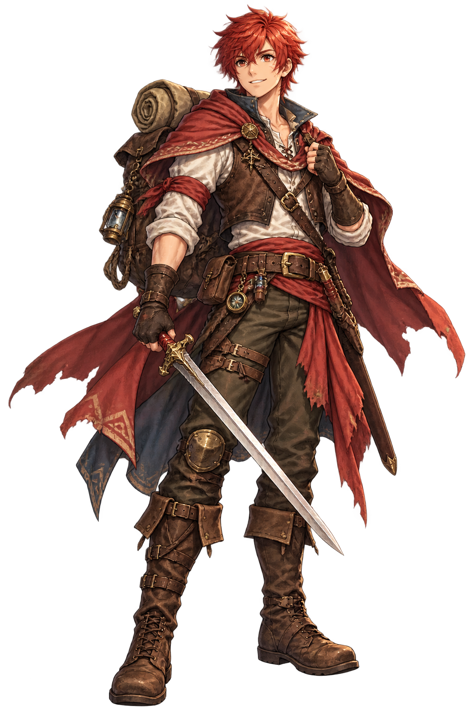
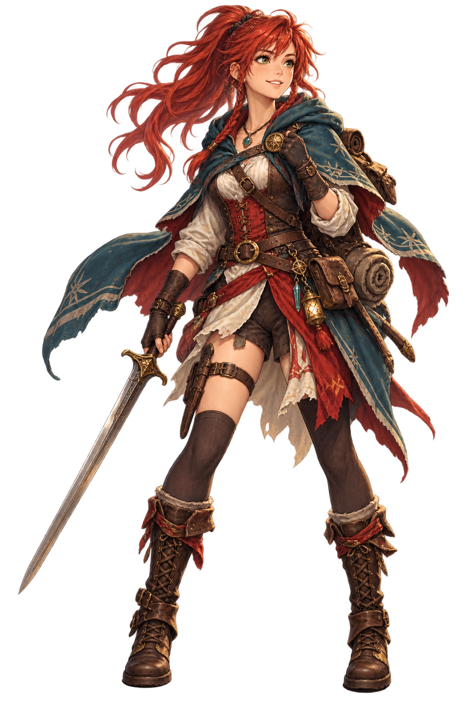

# グラナダ開拓記 (プレイ版)

ドラクエ風のコマンド選択式パーティ制JRPG × デッキ構築。

▶ **ブラウザでプレイ**: https://kuso-von-bazu.github.io/granada-jrpg-play/

## 主人公イラスト案 (Issue #91)

約20歳・赤毛・冒険者風・希望と野望に満ちた表情を軸にした新規案です。現行絵の自動差し替えではなく、比較・検討用です。

| 男性主人公案 | 女性主人公案 |
|---|---|
|  |  |

- [世界観設定 (Issue #92)](WORLD_BUILDING.md)

- 画面が変・止まった時は **Ctrl+Shift+R**(スーパーリロード)を試してください
- セーブはブラウザ内に保存されます(同じブラウザなら「つづきから」で再開できます)

## 要望・バグ報告

遊んでみて気になったことは [Issues](https://github.com/kuso-von-bazu/granada-jrpg-play/issues) からどうぞ!
「こうしたい」「ここが変」を書いてもらえれば拾って反映します。

## あそびかた(ざっくり)

- マップの光っているポイントをクリックして移動。未知の場所は霧に隠れています
- あやしい場所は「近くをクリック」すると何か見つかるかも。魔力探知のスキルカードが必要な隠し場所もあります
- 戦闘は手札からカードを1枚選んで行動。使ったカードはマナ結晶になり、強力なカードのコストになります
- スキルカードは使うと減り、**街に戻って休憩するまで回復しません**。計画的に!
- 代官所でクエストを受けると行ける場所が増えます
