# モブキャラクターカード案 (Issue #94)

パーティキャラクターと同じ、絵画的なアニメJRPG調を共通仕様にした比較・検討用の20案です。

| 01 若者市民・パン職人 | 02 若者市民・仕立屋 |
|---|---|
| 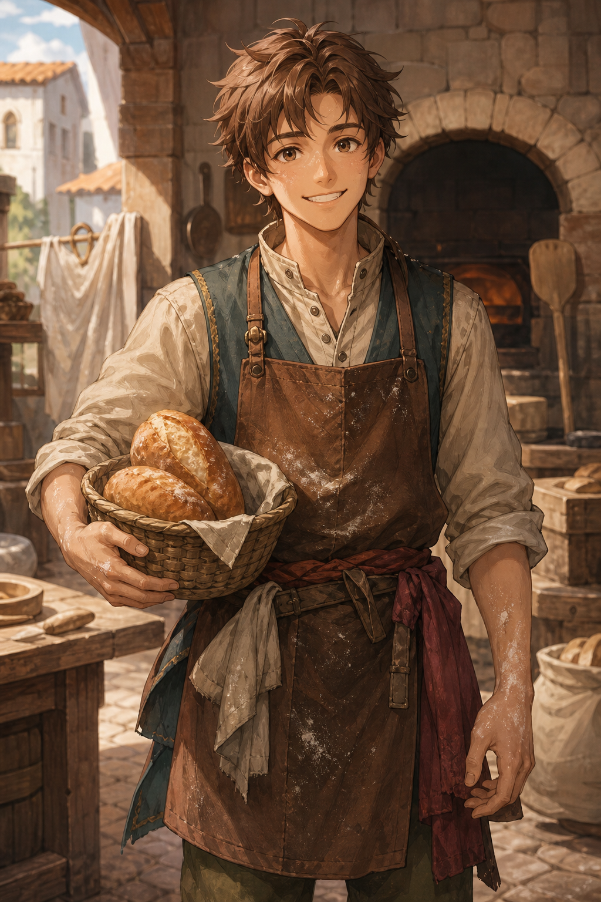 | 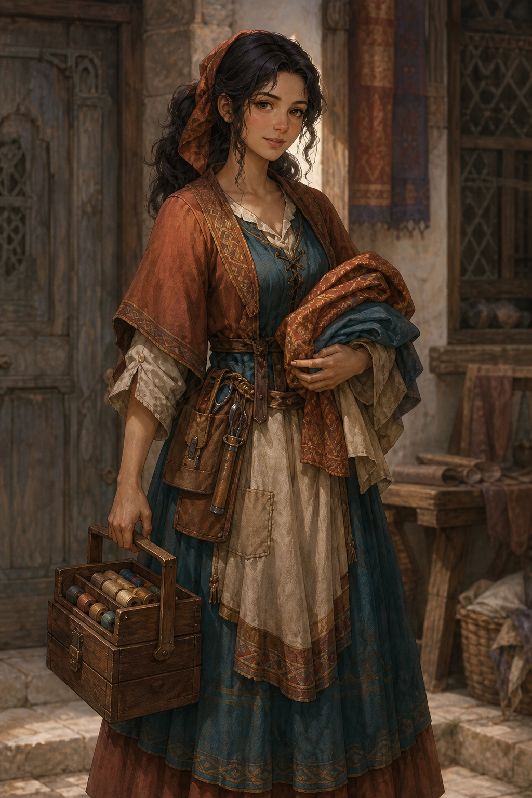 |
| 03 若者市民・港湾労働者 | 04 若者市民・配達人 |
| 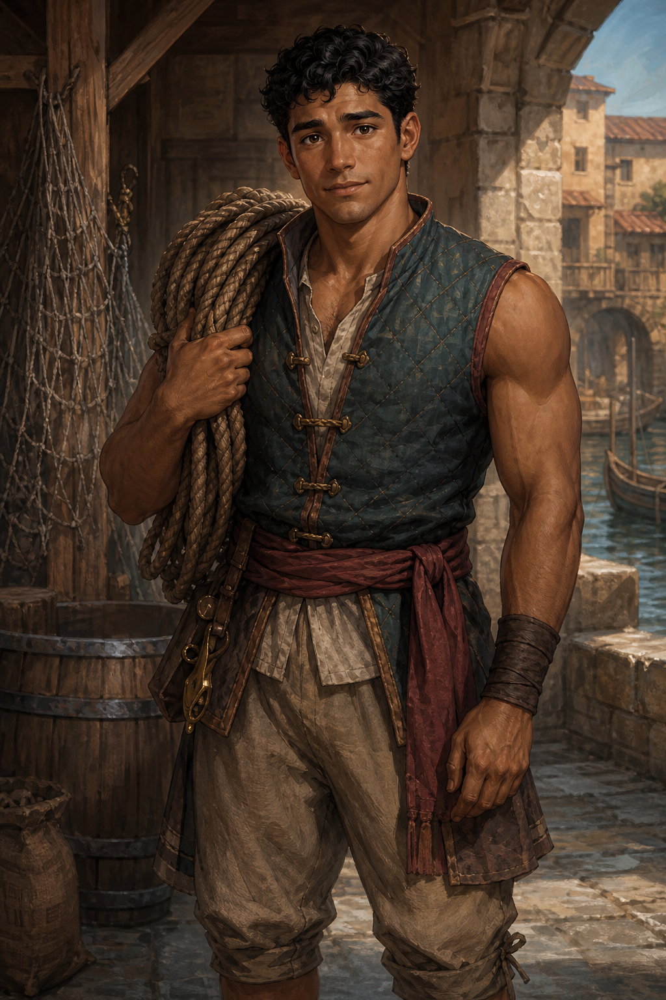 | 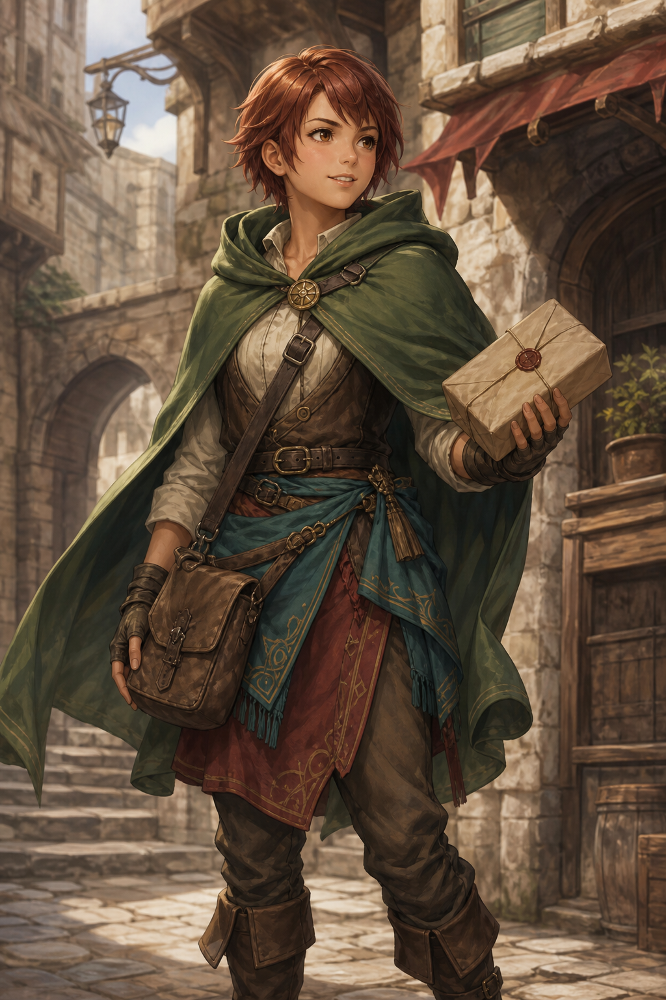 |
| 05 少年 | 06 少女 |
|  | 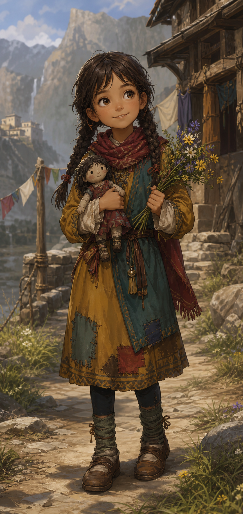 |
| 07 老人男性・元石工 | 08 老人女性・薬草師 |
| 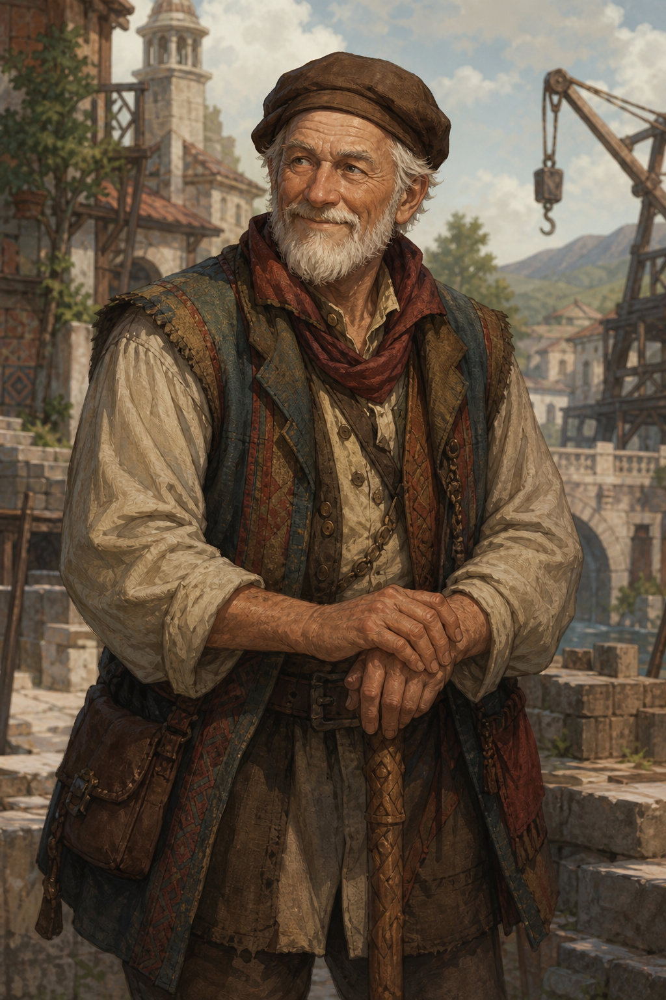 | 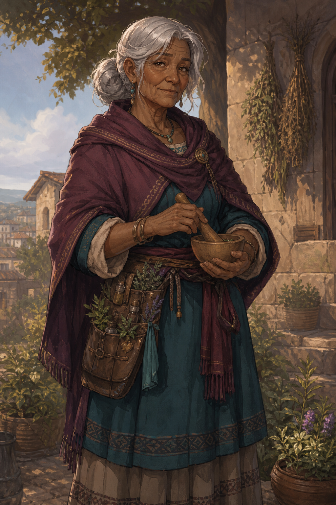 |
| 09 男性兵士・槍兵 | 10 女性兵士・門衛 |
| 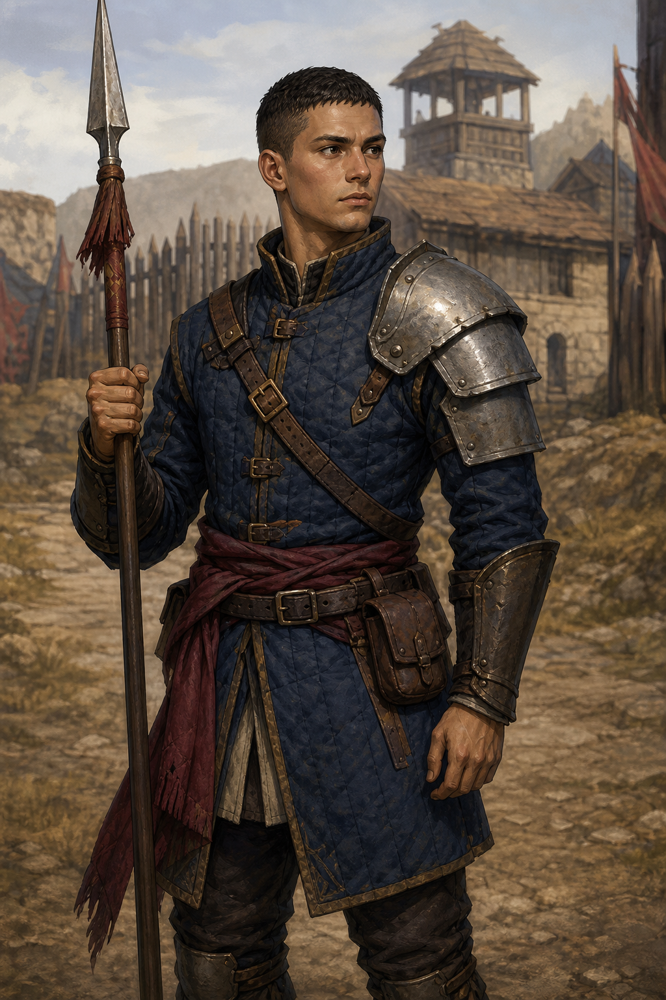 | 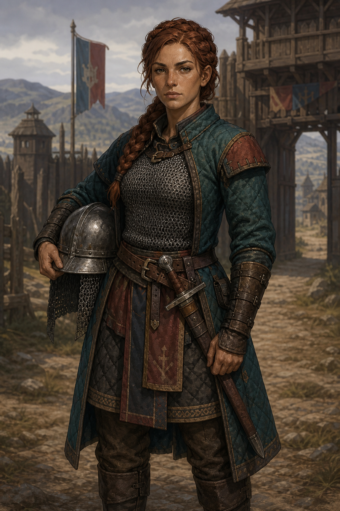 |
| 11 男性兵士・盾兵 | 12 酒場の主人 |
|  |  |
| 13 エルフ若者男性 | 14 エルフ若者女性 |
|  | 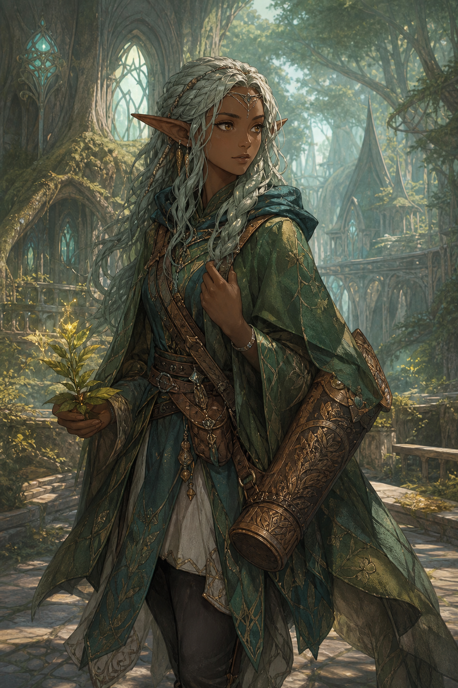 |
| 15 男性商人 | 16 女性商人 |
| 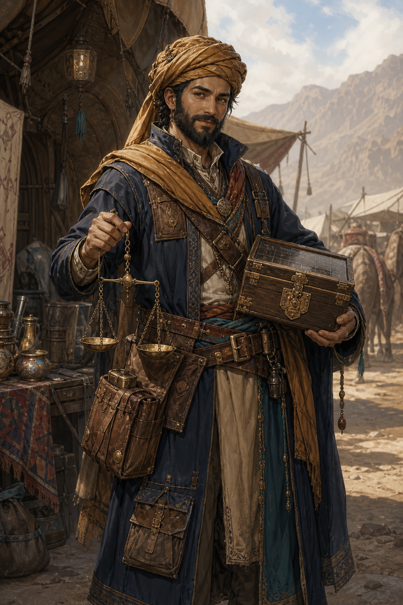 | 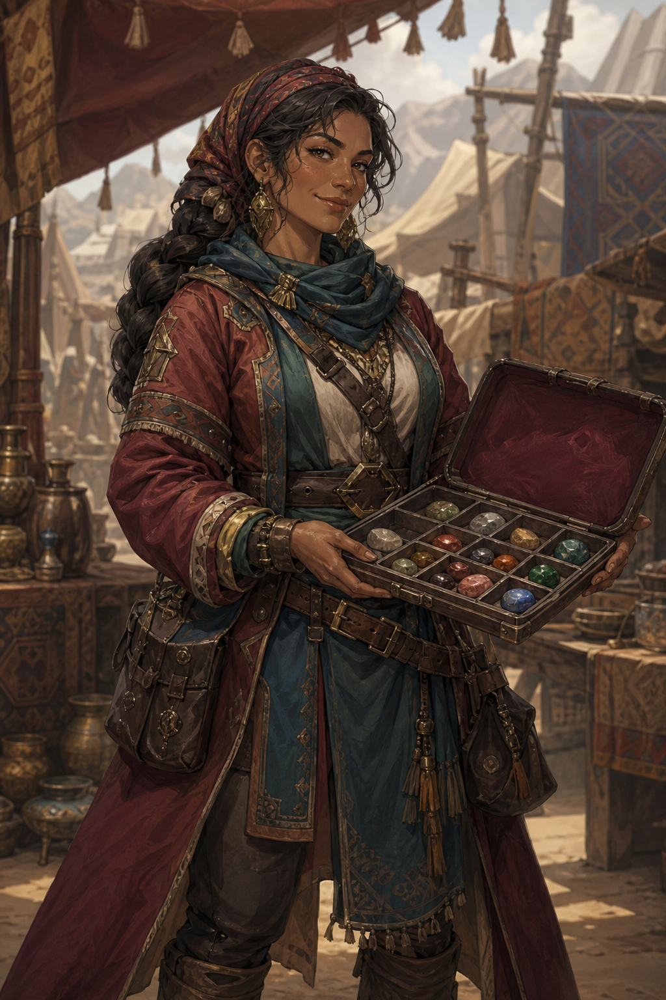 |
| 17 魔族商人・シャビの友人 | 18 男性傭兵 |
| 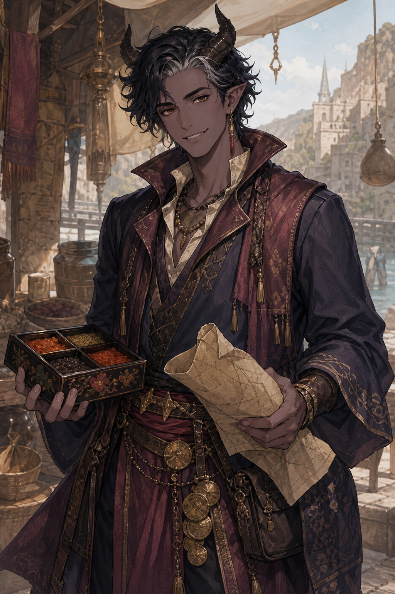 |  |
| 19 女性傭兵 | 20 聖職者 |
| 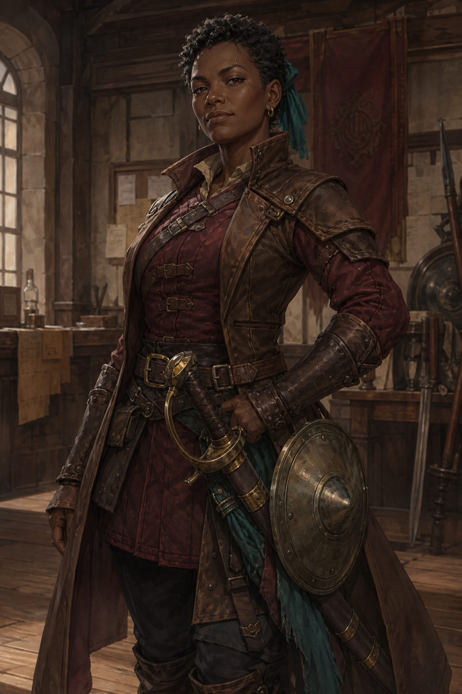 |  |

全画像は1024×1536 PNGです。現行ゲームへの自動差し替えではなく、役割・衣装・種族表現を比較するための初期提案です。
